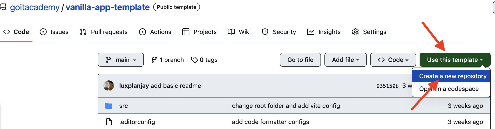
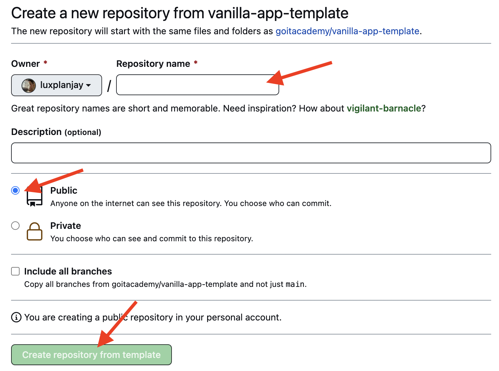
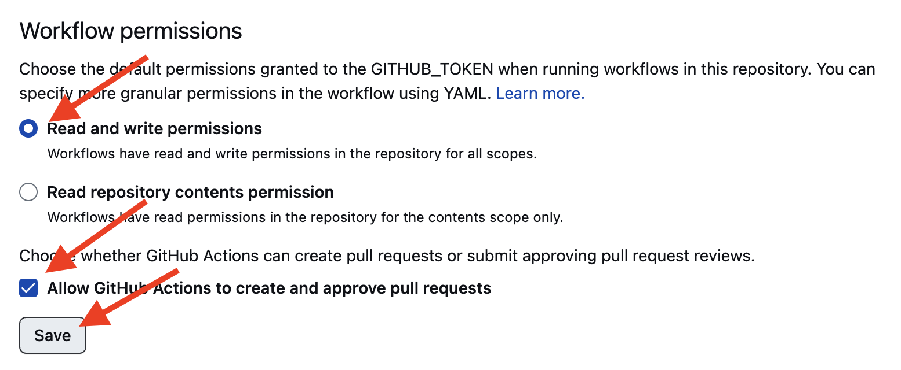

# 🖼️ Image Search Gallery

Веб-додаток для пошуку та перегляду зображень через API Pixabay з використанням модального вікна SimpleLightbox.

## ✨ Функціональність

- 🔍 **Пошук зображень** за ключовим словом
- 📱 **Адаптивна галерея** з автоматичним макетом (CSS Grid)
- 🎬 **Модальне вікно** SimpleLightbox для перегляду великих зображень
- ⏳ **Індикатор завантаження** з плавною анімацією під час запиту до сервера
- 📢 **Нотифікації** через iziToast (якщо результати не знайдені)
- 🎨 **Мінімалістичний дизайн** із синьо-сірою колірною схемою
- ✅ **Форматування коду** за допомогою Prettier

## 🛠️ Технологічний стек

- **Vite** – висока швидкість збірки проекту
- **Axios** – HTTP-запити до API Pixabay
- **SimpleLightbox** – модальне вікно для перегляду зображень
- **iziToast** – нотифікаційна система
- **Prettier** – автоматичне форматування коду
- **CSS3** – сучасна стилізація та анімації

## 📋 Передумови

- Node.js (LTS версія)
- npm або yarn

## 🚀 Запуск проекту

1. **Встанови залежності:**
   ```bash
   npm install
   ```

2. **Заміни API ключ Pixabay** у файлі `src/js/pixabay-api.js`:
   ```javascript
   const API_KEY = 'YOUR_PIXABAY_API_KEY'; // Встав свій ключ з pixabay.com/api/
   ```
   [Отримай безкоштовний ключ на Pixabay](https://pixabay.com/api/)

3. **Запусти режим розробки:**
   ```bash
   npm run dev
   ```
   Проект буде доступний за адресою `http://localhost:5173`

4. **Для продакшену:**
   ```bash
   npm run build
   ```

## 📁 Структура проекту

```
src/
├── js/
│   ├── main.js                  # Логіка додатку та обробка подій
│   ├── pixabay-api.js           # HTTP-запити до Pixabay API
│   └── render-functions.js      # Відображення елементів та управління DOM
├── css/
│   ├── styles.css               # Основні стилі (импорти)
│   ├── gallery.css              # Стилі галереї та спіннера завантаження
│   ├── search-form.css          # Стилі форми пошуку
│   └── інші CSS файли
├── partials/
│   ├── header.html
│   ├── footer.html
│   └── інші HTML компоненти
└── index.html                   # Основна сторінка
```

## 🎯 API Pixabay

**Параметри запиту:**
- `key` – унікальний API ключ
- `q` – пошукове слово (введене користувачем)
- `image_type: 'photo'` – тільки фотографії
- `orientation: 'horizontal'` – горизонтальна орієнтація
- `safesearch: true` – фільтр за віком

**Відповідь:** об'єкт з массивом `hits`, що містить об'єкти зображень з властивостями:
- `webformatURL` – URL мініатюри для галереї
- `largeImageURL` – URL великої версії для модального вікна
- `likes`, `views`, `comments`, `downloads` – статистика

## 🔧 npm скрипти

```bash
npm run dev          # Запуск режиму розробки з hot reload
npm run build        # Збірка для продакшену
npm run preview      # Перегляд продакшн збірки
npm run format       # Форматування коду за допомогою Prettier
npm run format:check # Перевірка наявності потреби у форматуванні
```

## 📝 Ліцензія

ISC

## 👨‍💻 Автор

Alexander Repeta

---

Що стосується деплою та налаштування GitHub Pages, дивись додаткові розділи нижче:

## Створення репозиторію за шаблоном

Використовуй цей репозиторій організації GoIT як шаблон для створення
репозиторію свого проекту. Для цього натисни на кнопку `«Use this template»` і
обери опцію `«Create a new repository»`, як показано на зображенні.



На наступному етапі відкриється сторінка створення нового репозиторію. Заповни
поле його імені, переконайся, що репозиторій публічний, після чого натисни
кнопку `«Create repository from template»`.



Після того, як репозиторій буде створено, необхідно перейти в налаштування
створеного репозиторію на вкладку `Settings` > `Actions` > `General` як показано
на зображенні.


Проскроливши сторінку до самого кінця, в секції `«Workflow permissions»` обери
опцію `«Read and write permissions»` і постав галочку в чекбоксі. Це необхідно
для автоматизації процесу деплою проекту.



Тепер у тебе є особистий репозиторій проекту, зі структурою файлів та папок
репозиторію-шаблону. Далі працюй з ним, як з будь-яким іншим особистим
репозиторієм, клонуй його собі на комп'ютер, пиши код, роби коміти та відправляй
їх на GitHub.

## Підготовка до роботи

1. Переконайся, що на комп'ютері встановлено LTS-версію Node.js.
   [Скачай та встанови](https://nodejs.org/en/) її якщо необхідно.
2. Встанови базові залежності проекту в терміналі командою `npm install`.
3. Запусти режим розробки, виконавши в терміналі команду `npm run dev`.
4. Перейдіть у браузері за адресою
   [http://localhost:5173](http://localhost:5173). Ця сторінка буде автоматично
   перезавантажуватись після збереження змін у файли проекту.

## Файли і папки

- Файли розмітки компонентів сторінки повинні лежати в папці `src/partials` та
  імпортуватись до файлу `index.html`. Наприклад, файл з розміткою хедера
  `header.html` створюємо у папці `partials` та імпортуємо в `index.html`.
- Файли стилів повинні лежати в папці `src/css` та імпортуватись до HTML-файлів
  сторінок. Наприклад, для `index.html` файл стилів називається `index.css`.
- Зображення додавай до папки `src/img`. Збирач оптимізує їх, але тільки при
  деплої продакшн версії проекту. Все це відбувається у хмарі, щоб не
  навантажувати твій комп'ютер, тому що на слабких компʼютерах це може зайняти
  багато часу.

## Деплой

Продакшн версія проекту буде автоматично збиратися та деплоїтись на GitHub
Pages, у гілку `gh-pages`, щоразу, коли оновлюється гілка `main`. Наприклад,
після прямого пуша або прийнятого пул-реквесту. Для цього необхідно у файлі
`package.json` змінити значення прапора `--base=/<REPO>/`, для команди `build`,
замінивши `<REPO>` на назву свого репозиторію, та відправити зміни на GitHub.

```json
"build": "vite build --base=/<REPO>/",
```

Далі необхідно зайти в налаштування GitHub-репозиторію (`Settings` > `Pages`) та
виставити роздачу продакшн версії файлів з папки `/root` гілки `gh-pages`, якщо
це не було зроблено автоматично.


### Статус деплою

Статус деплою крайнього коміту відображається іконкою біля його ідентифікатора.

- **Жовтий колір** - виконується збірка та деплой проекту.
- **Зелений колір** - деплой завершився успішно.
- **Червоний колір** - під час лінтингу, збірки чи деплою сталася помилка.

Більш детальну інформацію про статус можна переглянути натиснувши на іконку, і в
вікні, що випадає, перейти за посиланням `Details`.


### Жива сторінка

Через якийсь час, зазвичай кілька хвилин, живу сторінку можна буде подивитися за
адресою, вказаною на вкладці `Settings` > `Pages` в налаштуваннях репозиторію.
Наприклад, ось посилання на живу версію для цього репозиторію

[https://goitacademy.github.io/vanilla-app-template/](https://goitacademy.github.io/vanilla-app-template/).

Якщо відкриється порожня сторінка, переконайся, що у вкладці `Console` немає
помилок пов'язаних з неправильними шляхами до CSS та JS файлів проекту
(**404**). Швидше за все у тебе неправильне значення прапора `--base` для
команди `build` у файлі `package.json`.

## Як це працює


1. Після кожного пуша у гілку `main` GitHub-репозиторію, запускається
   спеціальний скрипт (GitHub Action) із файлу `.github/workflows/deploy.yml`.
2. Усі файли репозиторію копіюються на сервер, де проект ініціалізується та
   проходить лінтинг та збірку перед деплоєм.
3. Якщо всі кроки пройшли успішно, зібрана продакшн версія файлів проекту
   відправляється у гілку `gh-pages`. В іншому випадку, у лозі виконання скрипта
   буде вказано в чому проблема.
